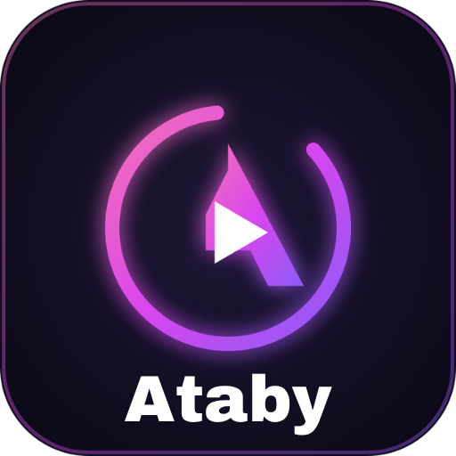

# Ataby OS 🚀



**Ataby OS** is an innovative, hybrid Linux-based operating system designed to bridge performance and aesthetics. It seamlessly runs native Linux apps, Android applications, and Windows games under a unified ecosystem with custom intelligent resource management.

---

## 🎨 Visual Identity: MetroWiz

Ataby OS introduces **MetroWiz**, a modern desktop shell combining nostalgia and fluid design:
* **Frutiger Metro:** Dynamic, bold, typography-driven Live Tiles.
* **TouchWiz Aesthetics:** Soft squircle geometry, glassmorphism, fluid water/ripple effects, and smooth animations.
* **Signature Palette:** Vibrant neon pink (`#FF52D9`) and deep purple (`#9143FF`) accents over dark themes.

---

## 🛠️ System Architecture

* **Kernel Layer:** Custom-patched Linux kernel featuring Android `BinderFS` and `Ashmem` IPC integration.
* **Desktop Shell:** High-performance Qt6/QML desktop UI powered by a modern Wayland compositor.
* **Android Subsystem:** Native, zero-emulation Android Runtime (ART) via containerized Binder IPC.
* **Gaming Subsystem:** Optimized Proton and Vulkan driver integration for low-latency Windows gaming.
* **Ataby Core (`ataby-cored`):** An intelligent daemon that dynamically manages system resources by sleeping or waking background translation layers (ART/Proton) on demand.

---

## 📁 Repository Structure

```text
├── docs/             # GitHub Pages & documentation assets
├── kernel/           # Custom kernel build configs, patches, and driver modules
├── services/         # ataby-cored system management service codebase
└── shell/            # MetroWiz UI desktop shell (Qt6 / QML)
